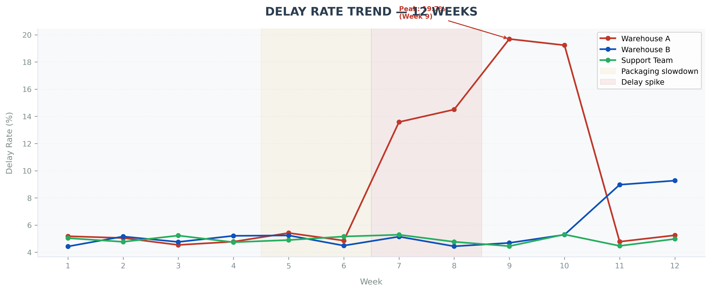
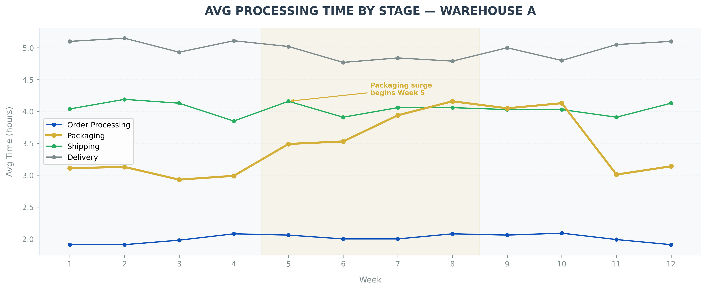
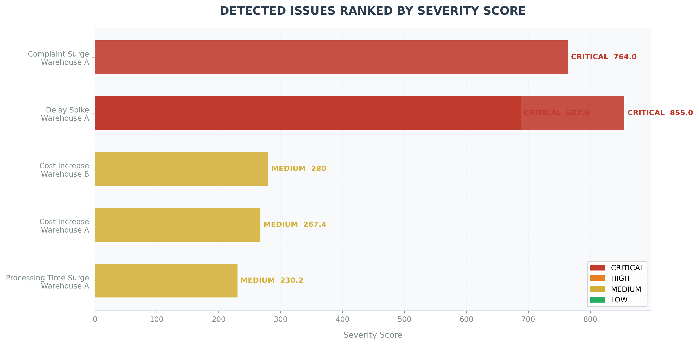
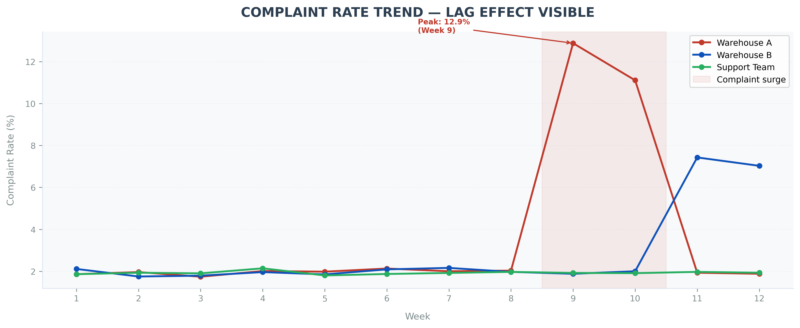
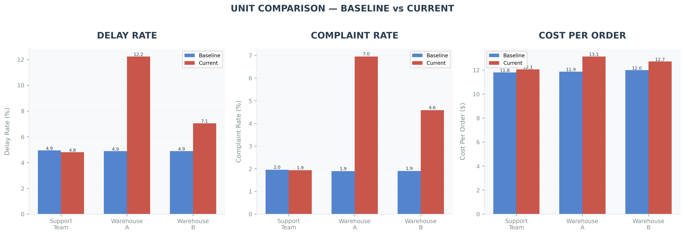
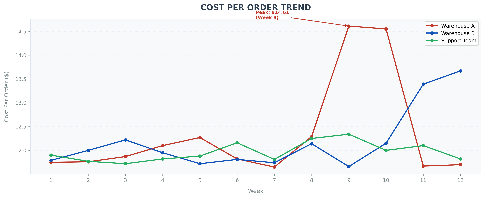
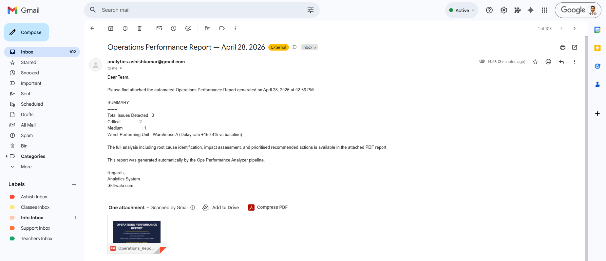

<h1 align="center">Ops Performance Analyzer</h1>

<p align="center">
  <b>Python + Claude API + ReportLab | Automated Operations Intelligence System</b><br>
  <sub>Detects operational failures, scores them by severity, traces root causes, and delivers a board-ready PDF report via email — fully automated</sub>
</p>

<p align="center">
  
  
  
  
  
  
  
</p>

---

## The Short Version

Operations teams waste hours every week writing the same report manually. This system does it automatically.

6 problems detected. 3 critical. Root cause traced to a single packaging bottleneck in Week 5. Full 12-page PDF report with AI-written diagnosis generated and emailed — typically in under a minute.

---

## The Core Problem

Every week, operations managers open their data and ask the same four questions — what went wrong, where did it start, how bad is it compared to everything else, and what do I fix first.

Most of them cannot answer all four quickly. They look at charts, draw their own conclusions, write a summary, and send it up the chain. The process takes hours and the output is often vague.

This system answers all four questions automatically, ranks every problem by a calculated severity score, traces the root cause chain, and delivers a formatted PDF report to the right person's inbox before the morning standup.

---

## Why This Matters for a Business

Without a system like this, operations teams face the same problems every week:

- Hours spent manually analysing data that could be automated
- Root causes are guessed, not proven — fixes target symptoms instead of sources
- Problems are discovered late, after customer complaints have already started
- Decisions are based on intuition instead of structured, repeatable analysis

This leads to delayed fixes, higher operational costs, and poor customer experience. This system replaces manual analysis with an automated decision pipeline that runs on schedule and delivers results without anyone having to trigger it.

---

## What This Actually Does

It ingests weekly operational data, calculates six KPIs, compares them against a baseline, detects anomalies, scores every problem by severity, chains the root cause sequence, sends structured findings to the Claude API, and produces a 12-page PDF report with charts and AI-written recommendations — then emails it automatically.

```
Raw Data → KPI Calculation → Baseline Comparison → Problem Detection
    → Severity Scoring → Root Cause Chain → Claude API → PDF Report → Email
```

---

## The Single Biggest Finding from the Demo Dataset

**A 17% increase in packaging processing time in Week 5 caused a cascading failure that took 6 weeks to fully resolve and spread to a second warehouse.**

By Week 9, Warehouse A's delay rate had reached 19.7% — nearly 4x the baseline of 4.9%. Customer complaints peaked at 12.9% — 545% above baseline. Cost per order rose from $11.87 to $14.61. The problem spread to Warehouse B by Week 11.

The system detected all of this, ranked it by severity, traced it back to the packaging stage in Week 5, and recommended specific corrective actions with timeframes.



---

## What the Numbers Show

| Metric | Value | What It Means |
|---|---|---|
| Problems detected | 6 | Across 3 units over 12 weeks |
| Critical severity issues | 3 | Delay spike and complaint surge in Warehouse A |
| Baseline delay rate | 4.9% | Weeks 1-4 average across all units |
| Peak delay rate | 19.7% | Warehouse A, Week 9 — 302% above baseline |
| Peak complaint rate | 12.9% | Warehouse A, Week 9 — 545% above baseline |
| Peak cost per order | $14.61 | vs $11.87 baseline — 23% increase |
| Weeks to spread | 6 | From root cause in Week 5 to Warehouse B in Week 11 |

---

## How the System Detects Problems

The system has five layers of logic built in — it does not just show charts and leave interpretation to the reader.

### Layer 1 — KPI Calculation

Six KPIs calculated from raw data every run: delay rate, defect rate, complaint rate, average processing time, cost per order trend, and throughput. Each calculated at unit and stage level, not just overall averages.

### Layer 2 — Baseline Comparison

Weeks 1 to 4 are treated as the performance baseline. Every KPI in the current period is compared against this baseline and the percentage change is calculated. This is how the system knows that a 7% delay rate is bad — because the baseline was 4.9%, making it a 44% increase.

### Layer 3 — Threshold Detection

Five detection rules flag problems automatically. A delay spike is flagged when the rate increases more than 5 percentage points week over week. A processing time surge is flagged when any stage increases more than 15% in a single week. A complaint surge is flagged at 8 percentage points week over week. Cost increase is flagged when costs rise more than 10% while volume stays flat.

### Layer 4 — Severity Scoring

Every detected problem gets a severity score from three factors — how large the change was, how important that metric is to the business, and how many orders were affected. Delay rate carries the highest business impact weight of 9 because it directly affects customer SLA. Problems scoring above 500 are labelled CRITICAL. Above 300 is HIGH. Above 150 is MEDIUM.

This scoring answers the question most dashboards cannot: which problem do I fix first?

### Layer 5 — Root Cause Chaining

Before the AI call, the system pre-structures the causal chain by sorting all detected problems by week of detection. The AI receives this chain and reasons about causality — not just individual metrics in isolation.

---

## What Was Assumed vs What the Data Actually Showed

| Assumption | Expected | Reality |
|---|---|---|
| Packaging bottleneck would cause downstream delays | Yes, will cascade | Confirmed — 2 week lag between packaging surge and delay spike |
| Complaints would follow delays with a lag | Yes, with some delay | Confirmed — complaints spiked 4 weeks after the packaging failure |
| Problem would stay contained to one unit | Yes, one unit | Wrong — spread to Warehouse B by Week 11 |
| Cost increase would happen simultaneously with delays | Yes, same week | Wrong — cost rose 4 weeks later, driven by complaint handling |
| Support Team would be unaffected | Yes, stable | Confirmed — Support Team metrics stayed flat throughout |

Three out of five assumptions were wrong. This is why building a detection system matters more than relying on intuition.

---

## What the Charts Show



The packaging line in gold shows the surge beginning in Week 5 — 2 weeks before delays spike. This is the clearest visual proof of the root cause.



Every detected problem ranked by severity score. The top 3 are CRITICAL — all in Warehouse A.



The lag effect is clearly visible. Complaints stayed flat until Week 9 — 4 weeks after the delay spike started.



Baseline vs current across all 3 units. Warehouse A's degradation is immediately obvious. Support Team is stable. Warehouse B shows the beginning of contamination by Week 12.



Cost per order stayed stable until Week 9 then spiked to $14.61 — consistent with complaint handling and expedited shipping costs.

---

## The AI Layer

The system sends four structured inputs to the Claude API: the baseline vs current comparison table, the ranked issue list with severity scores, the pre-structured root cause chain ordered by week, and a KPI summary. The prompt instructs Claude not to describe the data but to diagnose it — identify the first problem, explain how it propagated, quantify the business impact, and give specific recommended actions with a decision priority table.

The result reads like it was written by a senior operations analyst who studied the data for an hour — not a generic AI summary.

> This system uses rule-based detection combined with AI reasoning. It does not rely on machine learning models and is designed for transparency and interpretability. Every number in the AI output comes from the structured data the system provides — Claude does not generate figures.

---

## Automated Email Delivery

The final step sends the PDF report to a designated recipient automatically. The email includes a plain-text summary of the key numbers — total issues, critical count, worst performing unit — so the reader knows what they are opening before they look at the PDF.



The system is scheduled via Windows Task Scheduler to run daily at 8:00 AM. The operations manager receives the report before their morning standup without anyone having to run anything manually.

---

## Validated on Real Data

The detection logic was tested on a real logistics dataset from Kaggle containing 32,065 shipment records. The system detected 72 operational anomalies — all LOW severity, which is expected because real data has many small fluctuations rather than one large cascading failure.

This validates that the system runs on real messy data and detects patterns when they genuinely exist without generating false alarms from noise.

---

## Data Quality Checks

Before running analysis, the simulated dataset was validated:

- Shape confirmed — 144 rows, 11 columns, 12 weeks, 3 units, 4 stages
- No missing values across any column
- Delay rates verified manually for Weeks 1-4 baseline and Weeks 7-10 spike period
- Processing time surge confirmed in packaging stage from Week 5 onward
- Root cause chain ordering verified — Week 5 event precedes all downstream events

---

## Dataset

| Detail | Simulated Dataset | Real Dataset |
|---|---|---|
| Source | Generated by generate_data.py | Kaggle — Dynamic Supply Chain Logistics Dataset |
| Total Rows | 144 | 32,065 |
| Columns | 11 | 26 |
| Weeks Covered | 12 | 12 (aggregated) |
| Type | Controlled simulation | Real logistics data |
| Purpose | Demo and PDF report | System validation |

The simulated dataset has a built-in degradation pattern for a clear root cause chain. The real dataset has natural noise — the system finds what is genuinely there.

---

## Limitations

- Detection is rule-based and depends on threshold tuning — thresholds may need adjustment for different industries or operational contexts
- Real-world datasets may not always show clear root cause chains — the system detects patterns when they exist, not when they do not
- AI output quality depends on the structure and completeness of the data provided — garbage in, garbage out applies here too
- The simulated dataset is designed to produce a clean story — real operational data is messier and results will vary

---

## How to Run This

```bash
# 1. Clone the repo
git clone https://github.com/analytics-ak/ops-performance-analyzer.git
cd ops-performance-analyzer

# 2. Install dependencies
pip install -r requirements.txt

# 3. Create .env file in project root
# ANTHROPIC_API_KEY=your_claude_api_key
# GMAIL_SENDER=your_gmail@gmail.com
# GMAIL_APP_PASSWORD=your_16_char_app_password
# GMAIL_RECIPIENT=recipient@email.com

# 4. Run the full pipeline
python run.py
```

For daily automation on Windows — run `run_pipeline.bat` via Task Scheduler.

---

## Pipeline Architecture

| Step | Script | Output |
|---|---|---|
| 1 — Generate data | scripts/generate_data.py | data/ops_data_simulated.csv |
| 2 — Analyse | scripts/analyze.py | KPIs, detection, severity, root chain |
| 3 — AI insights | scripts/ai_insights.py | Executive summary, RCA, impact, actions |
| 4 — Charts | scripts/generate_report.py | 6 PNG charts in charts/ |
| 5 — PDF report | scripts/generate_report.py | output/Operations_Report.pdf |
| 6 — Email | scripts/send_email.py | Report delivered to inbox |
| Full pipeline | run.py | All 6 steps in one command |

---

## Project Structure

```
ops-performance-analyzer/
│
├── scripts/
│   ├── generate_data.py        <- creates simulated dataset with degradation pattern
│   ├── analyze.py              <- KPIs, baseline, detection, severity, root cause chain
│   ├── ai_insights.py          <- Claude API call with structured prompt
│   ├── generate_report.py      <- 6 charts + 12-page PDF generation
│   ├── send_email.py           <- automated email delivery with PDF attachment
│   ├── adapt_real_data.py      <- transforms Kaggle dataset to system format
│   └── validate_real_data.py   <- validates detection logic on real data
│
├── charts/                     <- 6 PNG charts + email screenshot
├── data/                       <- place data files here (see data/README.md)
├── output/                     <- generated PDF reports (gitignored)
│
├── run.py                      <- single command pipeline
├── run_pipeline.bat            <- Windows batch file for Task Scheduler
├── requirements.txt
├── .gitignore
└── README.md
```

---

## Skills Demonstrated

**Python Engineering** — End-to-end pipeline across 7 scripts. Modular design where each script is independently runnable and importable. Proper cross-platform path handling.

**Data Analysis with Pandas** — KPI calculation, week-over-week change detection, groupby aggregations, baseline vs current comparison, time-series trend analysis at unit and stage level.

**Algorithmic Problem Detection** — Rule-based anomaly detection with five detection types. Severity scoring formula combining magnitude, business impact weight, and volume. Root cause chaining by chronological event ordering.

**AI API Integration** — Structured prompt engineering with the Claude API. Prompt forces diagnosis not description. Response parsing extracting five sections from free-form AI output.

**PDF Generation with ReportLab** — 12-page formatted PDF with cover page, data tables, embedded charts, AI narrative sections, and decision priority table. 300 DPI chart embedding.

**Email Automation** — Gmail SMTP with App Password authentication. MIMEMultipart email with plain-text body and PDF attachment. Dynamic content populated from pipeline results.

**Data Transformation** — Real-world Kaggle dataset with 32,065 rows and 26 columns transformed into the system's operational schema using pandas aggregations and business logic mapping.

**Pipeline Automation** — Windows Task Scheduler integration via batch file for daily automated execution. Single-command pipeline with status reporting at each stage.

---

## Tech Stack

| Tool | Purpose |
|---|---|
| Python | Core language |
| Pandas | KPI calculation, aggregation, transformation |
| Anthropic SDK | Claude API for AI narrative generation |
| Matplotlib | 6 charts at 300 DPI |
| ReportLab | 12-page PDF generation |
| smtplib | Email automation via Gmail SMTP |
| python-dotenv | Secure credential management |
| Windows Task Scheduler | Daily automated execution |

---

## Author

**Ashish Kumar Dongre**

[LinkedIn](https://www.linkedin.com/in/ashish-kumar-dongre-742a6217b/) | [GitHub](https://github.com/analytics-ak) | [Dataset on Kaggle](https://www.kaggle.com/datasets/datasetengineer/logistics-and-supply-chain-dataset)
